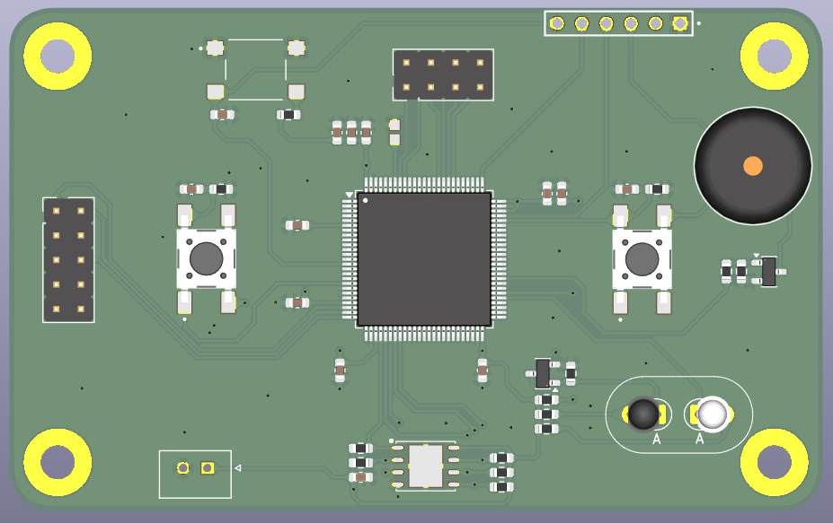

# IR_PROGRAMMER

A standalone, button-operated firmware programmer for **STM32L0** microcontrollers, built on an STM32L073VBT.
It stores a firmware image in its own flash and writes it to a target MCU over one of two links:

| Link | Button | How it works | Needs a PC? | Needs code on the target? |
|------|--------|--------------|-------------|---------------------------|
| **IR** (infrared) | SW3 | Talks to the target's **built-in ROM bootloader** (ST AN3155 USART protocol) through an IR LED / phototransistor pair | No | **No** |
| **SWD** (wired) | SW1 | Bit-banged Serial Wire Debug: attaches to the core, halts it and programs the flash controller directly | No | No |

Press a button, wait for the beeps, and the next board is programmed. There is no PC, no debugger and no cable to the target on the IR path.

> **AI-generated code notice:** This software was created with the help of AI (Claude Code by Anthropic). Review and test it on your own hardware before using it in production. See [AI disclosure](#ai-disclosure).

---

## Why IR uses the target's internal bootloader

Every STM32 ships from the factory with a **system bootloader** in ROM ("system memory"). It is written by ST, it lives in a read-only area and it cannot be erased or overwritten. When the target starts from system memory, this bootloader listens on its USART and accepts the standard ST serial protocol described in **AN3155**. The protocol has commands to read the chip ID, erase flash, write memory and jump to the application.

This programmer uses that bootloader as the receiving end of the IR link. As a result:

- **The target needs no extra software.** You do not have to flash a custom IR bootloader first, reserve flash space for one, or maintain one. A brand-new, blank STM32 can be programmed over IR straight from the factory.
- **Nothing on the target can "brick" the IR path.** The ROM bootloader cannot be damaged by a bad application image, so you can always reflash over IR again.
- **The protocol is standard.** The IR link carries the same bytes that STM32CubeProgrammer would send over a UART cable (8 data bits + even parity, `0x7F` auto-baud, ACK `0x79` / NACK `0x1F`). The IR hardware simply replaces the wire.

The target only needs **hardware**:

1. An IR receiver/transmitter wired to one of the USART pins that its system bootloader listens on (see ST **AN2606** for the pins of your exact part).
2. A way to start the MCU in system memory boot mode. That usually means holding BOOT0 high (or configuring the equivalent option bytes) while power-cycling the target.

### IR programming sequence

Once SW3 is pressed, the programmer runs the following steps (`Program_Target()` in `firmware/Core/Src/main.c`):

1. **Connect:** sends `0x7F` so the target bootloader can auto-detect the baud rate (115200 by default) and waits for ACK. Up to 5 attempts.
2. **Get ID** (`0x02`): reads the target's product ID and writes it to the log.
3. **Erase** (`0x44`, Extended Erase): erases only the pages the image occupies, in batches of 32 pages, the same way STM32CubeProgrammer does. A global mass erase is not used because some bootloader versions NACK it.
4. **Write** (`0x31`, Write Memory): writes the image in 256-byte blocks starting at `0x08000000`, with retries on every block.
5. **Go** (`0x21`): jumps to the new application. There is no reset line on the IR link, so this command starts the firmware.

Each step retries on its own, so a weak or noisy IR link still gets through.

---

## SWD programming

The SWD path is for wired production or bench use. It needs a 3-wire connection (SWCLK, SWDIO, NRST) plus GND. Pressing SW1 runs `Program_Target_SWD()`:

1. Pulses NRST, switches the target's debug port from JTAG to SWD and reads the DP IDCODE. It expects `0x0BC11477` (Cortex-M0+ SW-DP).
2. Powers up the debug domain, sets up the AHB-AP and halts the core.
3. Unlocks the flash controller (PECR), erases the affected 128-byte pages and programs the image in 64-byte **half-page** bursts for speed.
4. Reads the whole image back and compares it with the source (**verify**).
5. Pulses NRST and releases the SWD pins so the new firmware runs.

The driver in `firmware/SWD/src/swd.c` does not depend on the HAL. It drives the GPIO registers directly and can be reused in other projects.

---

## Hardware

Programmer MCU: **STM32L073VBT** (LQFP100), running on HSI16 at 16 MHz. No external crystal is needed.

| Function | Pin | Notes |
|----------|-----|-------|
| IR TX (LPUART1_TX) | PD8 | Drives the IR LED cathode. Idle HIGH = LED off |
| IR RX (LPUART1_RX) | PD9 | Phototransistor → transistor stage. Idle HIGH |
| SWD SWCLK | PA2 | Connector J1 |
| SWD SWDIO | PA1 | Connector J1 |
| SWD NRST | PA0 | Connector J1, open-drain |
| Log TX (USART1_TX) | PB6 | Connector J3, 115200 8N1 |
| Log RX (USART1_RX) | PB7 | Connector J3 |
| Button SW1 (start SWD) | PC3 | Active HIGH |
| Button SW3 (start IR) | PA12 | Active HIGH |
| Buzzer | PD12 | Active HIGH, drives transistor Q3 |
| W25Q128 CS / RESET | PA4 / PC4 | External SPI flash. Held inactive; not used by this firmware |

The SWD pins stay high-impedance (analog) until an SWD cycle starts, so the programmer does not disturb a target left connected to it.

### PCB



The schematic and PCB layout are in [`hardware/`](hardware) as a KiCad project. Open `hardware/IR_Programmer.kicad_pro` in KiCad to view or edit them, or to generate Gerber and BOM files for manufacturing.

---

## Usage

1. Power the programmer. One short beep means it is ready.
2. **IR:** put the target in bootloader mode (BOOT0 high + power-cycle), point the IR windows at each other and press **SW3**.
   **SWD:** connect J1 to the target and press **SW1**.
3. One short beep marks the start. While programming runs, a short beep repeats about once per second.
4. Result:
   - **Two short beeps:** success.
   - **One long beep followed by N short beeps:** error code N (see the table below).
5. Press the button again to program the next board or to retry. Button presses made while programming is in progress are ignored.

### Error codes

| Beeps | Link | Meaning |
|-------|------|---------|
| 1 | IR | No reply to `0x7F`. The target is not in bootloader mode, the IR link is misaligned, or the baud rate is wrong |
| 2 | IR | Get ID failed |
| 3 | IR | Erase failed |
| 4 | IR | Write failed |
| 5 | SWD | Attach failed (no IDCODE, wrong chip, or the core could not be halted) |
| 6 | SWD | Flash unlock failed |
| 7 | SWD | Erase/program failed |
| 8 | SWD | Verify mismatch |

Connect a USB-UART adapter to **J3** (115200 8N1) to see a step-by-step log of every cycle, including the target ID, progress and the reason for any failure.

---

## Loading your own firmware image

The image to be programmed is compiled into the programmer as a C array in `firmware/Core/Inc/fw_image.h`:

```c
static const uint8_t fw_data[] = { 0x00, 0x50, 0x00, 0x20, /* ... */ };
static const uint32_t fw_size = sizeof(fw_data);
```

The repository ships with a 3-byte placeholder. To use your own firmware:

1. Build your target application and export a raw binary (`.bin`) that starts at `0x08000000`.
2. Convert it to a C array, for example:
   ```bash
   xxd -i -n fw_data app.bin > fw_array.txt
   ```
   Paste the array into `fw_image.h` and keep the `fw_data` / `fw_size` names.
3. Rebuild and flash the programmer.

Both the IR and SWD paths use the same image. The image has to fit in the programmer's own flash (128 KB on the STM32L073VB) next to the programmer firmware (about 24 KB).

---

## Configuration

These settings are at the top of `firmware/Core/Src/main.c`:

| Macro | Default | Purpose |
|-------|---------|---------|
| `IR_BAUDRATE` | `115200` | IR link speed. Try 57600 or 38400 if the link is marginal. After changing it, power-cycle the target, because the bootloader locks onto the first baud rate it sees |
| `TARGET_FLASH_BASE` | `0x08000000` | Address the image is written to |
| `SWD_CLK_DELAY` | `0` | SWD half-period delay. Increase it to 2–6 on long or noisy cables if you see parity, ACK or verify errors |

---

## Building

- **IDE:** Keil MDK 5 (ARM Compiler 6). Open `firmware/MDK-ARM/IR_PROGRAMMER.uvprojx`.
- A post-build step also creates `firmware/MDK-ARM/IR_PROGRAMMER.bin`.
- **MDK-Lite limitation:** the free MDK-Lite edition cannot link images larger than 32 KB. With a real firmware image embedded in `fw_image.h` you will probably go over that limit. In that case, use a licensed MDK (the free *MDK Community* or *MDK for STM32* licenses also work) or port the project to STM32CubeIDE / GCC.
- **STM32CubeMX:** `firmware/IR_PROGRAMMER.ioc` matches the code and can be regenerated safely. All custom code is kept inside `USER CODE BEGIN/END` blocks. When you edit generated files, keep your changes inside those blocks, or CubeMX will overwrite them.

### Project layout

```
firmware/
  Core/
    Inc/fw_image.h      firmware image to be programmed (placeholder)
    Inc/sys_conf.h      software version
    Src/main.c          IR bootloader client, SWD flow, buttons, buzzer, log
  SWD/
    inc/swd.h           SWD driver API and pin configuration
    src/swd.c           bit-bang SWD + STM32L0 flash programming
  Drivers/              STM32L0 HAL and CMSIS (from ST)
  MDK-ARM/              Keil project
  IR_PROGRAMMER.ioc     STM32CubeMX configuration
hardware/
  IR_Programmer.kicad_pro   KiCad project
  IR_Programmer.kicad_sch   schematic
  IR_Programmer.kicad_pcb   PCB layout
docs/
  pcb_3d.png            3D render of the board
```

---

## Limitations

- **Target family:** the SWD flash routines (PECR registers, 128-byte pages, 64-byte half-page programming) and the IR erase page size are written for the **STM32L0** series. Other STM32 families need changes to `swd.c` and `TARGET_PAGE_SIZE`.
- **Read-out protection:** the target must be at RDP level 0. A protected device rejects the bootloader's write commands and blocks SWD memory access.
- **No IR verify:** the IR path relies on the bootloader's per-block ACK and does not read the image back. The SWD path does verify.
- **Target boot mode:** there is no BOOT0 or reset line on the IR link. The target must already be in bootloader mode when you press SW3.

---

## AI disclosure

This project was developed with the help of AI (Claude Code by Anthropic). The AI was used for:

- writing the firmware source code (the IR bootloader client, the SWD driver and the application logic),
- reviewing and cleaning up the code,
- writing this documentation.

The code is provided as-is (see [LICENSE](LICENSE)). AI-generated code can contain mistakes that are hard to spot, so **review the source and test it on your own hardware before relying on it**, especially if you change the target family, the flash layout or the timing settings. Bug reports and pull requests are welcome.

---

## License

The original code of this project is released under the [MIT License](LICENSE).
The bundled ST HAL (BSD-3-Clause) and CMSIS (Apache-2.0) files under `firmware/Drivers/` keep their own licenses.

---

## References

- ST **AN3155**: USART protocol used in the STM32 bootloader
- ST **AN2606**: STM32 microcontroller system memory boot mode (bootloader pins per device)
- ST **RM0367**: STM32L0x3 reference manual (flash PECR programming)
- Arm **ADIv5**: Debug Interface Architecture Specification (SWD protocol)
